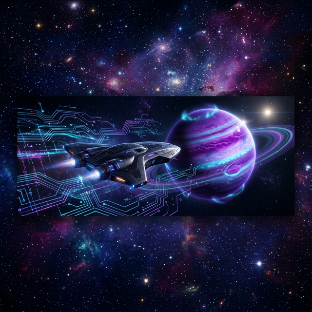

<!-- Banner -->

<!-- Animated typing effect -->

  

  
  
  

---

### 👨‍🚀 The Expedition

  

---

### 🛠️ Tech Arsenal

  

<table align="center" width="100%" style="border-collapse: collapse; border: none;">
  <tr style="border: none;">
    <td width="50%" align="center" style="border: none;">
      
    </td>
    <td width="50%" align="center" style="border: none;">
      
    </td>
  </tr>
</table>

---

### 📉 Galactic Metrics

<table align="center" width="100%">
  <tr>
    <td width="50%" align="center">
      
    </td>
    <td width="50%" align="center">
      
    </td>
  </tr>
</table>

---

### 🐍 The Code Snake

